# Smart Expense Tracker

A logical Flutter application designed to help users manage their daily expenses effectively. This app provides dynamic calculations, budget tracking, and advanced filtering without the need for external databases or APIs.

## 🚀 Features

- **Expense Management**: Add and delete expenses with details like title, amount, category, and date.
- **Budget Tracking**: Set a monthly budget and monitor remaining funds in real-time.
- **Spending Status**: Dynamic indicators based on budget usage:
    - 🟢 **Safe**: < 50%
    - 🟠 **Moderate**: 50% - 80%
    - 🟡 **Warning**: 80% - 100%
    - 🔴 **Over Budget**: > 100%
- **Dynamic Analytics**: View Total, Today's Total, Highest, Lowest, and Average expenses.
- **Advanced Filtering**: Filter by Today, This Week, This Month, or specific Categories (Food, Transport, Shopping, Other).
- **Responsive UI**: Built with Material 3 components for a modern and clean user experience.

## 📸 Screenshots

| 01. Home Screen | 02. Budget Setup | 03. Add Expense |
|:---:|:---:|:---:|
| 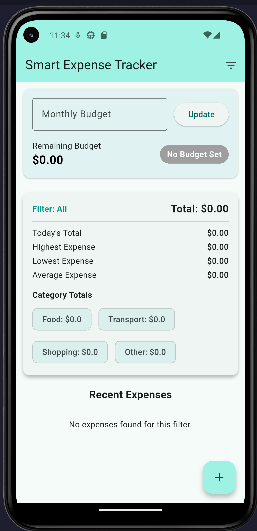 | 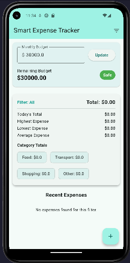 | 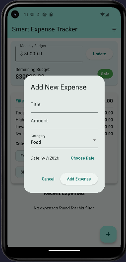 |

| 04. Shopping Safe | 05. House Rent Add | 06. Food Add |
|:---:|:---:|:---:|
| 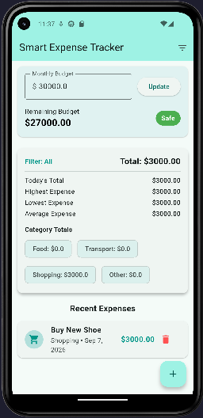 | 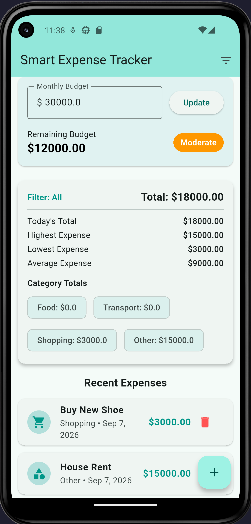 | 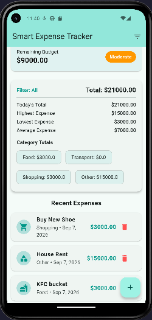 |

| 07. Warning Status | 08. Over Budget | 09. All Expenses |
|:---:|:---:|:---:|
| 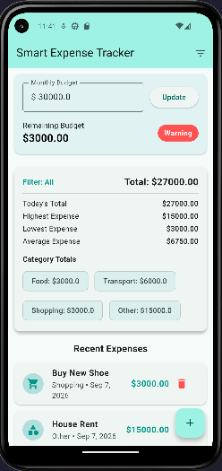 | 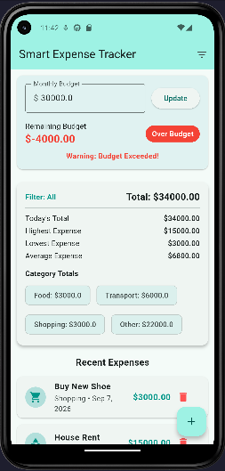 | 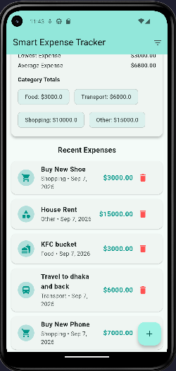 |

| 10. Filter Menu | 11. Food Category | 12. Transport Category |
|:---:|:---:|:---:|
| 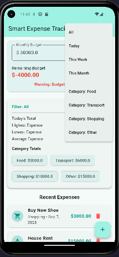 | 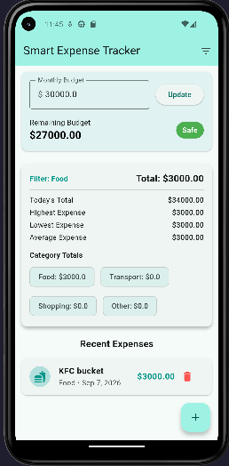 | 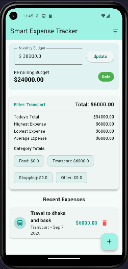 |

| 13. Shopping Category | 14. Others Category | 15. Today Filter |
|:---:|:---:|:---:|
| 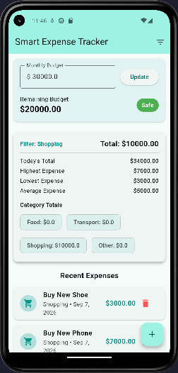 | 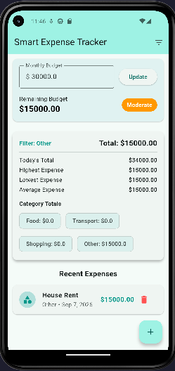 | 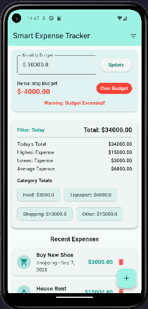 |

| 16. Week Filter | 17. Month Filter |
|:---:|:---:|
| 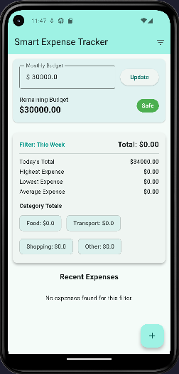 | 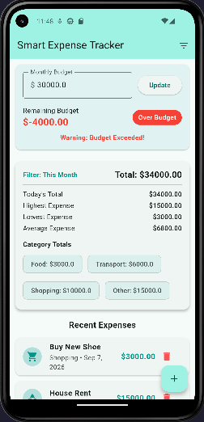 |

## 🛠️ Implementation Details

- **State Management**: Managed using Flutter's native `setState` for reactive UI updates.
- **Logic**: 
    - **Filtering**: Real-time list filtering using Dart's `where` method.
    - **Calculations**: Aggregated totals and averages using `fold` and `reduce`.
- **Validation**: Strict checks to ensure amounts and budgets are positive values.
- **Constraints**: No Firebase or external APIs used, focusing purely on local logic and UI.

## ⚙️ Getting Started

1.  **Clone the repository**:
    ```bash
    git clone https://github.com/Mdyeasinkhan4/smart_expense_tracker.git
    ```
2.  **Install dependencies**:
    ```bash
    flutter pub get
    ```
3.  **Run the app**:
    ```bash
    flutter run
    ```

## 📝 License
This project is for educational purposes as part of the OSTAD Flutter Assignment.

**Developed by Md. Yeasin Khan**
